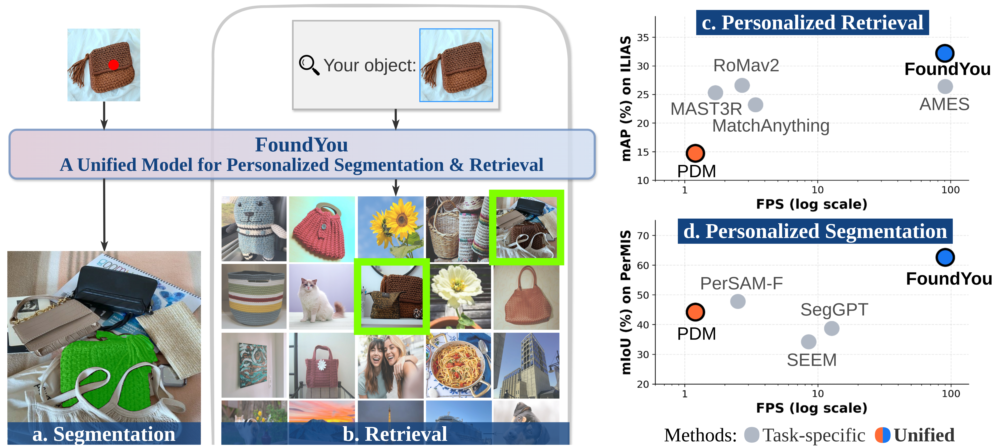

<div align="center">

# FoundYou: A Unified Model for Personalized Segmentation and Retrieval

<p align="center">
  <a href="https://arxiv.org/abs/2608.29917v1"></a>
  <a href="https://ga1i13o.github.io/FoundYou/"></a>
  <a href="https://gmberton.github.io/demos-url/foundyou/"></a>
  <a href="#"></a>
</p>

✨ **ECCV 2026** ✨

**[Gabriele Trivigno](https://scholar.google.com/citations?user=JXf_iToAAAAJ) ·
[Marcos Alfaro](https://scholar.google.com/citations?user=QXWedBkAAAAJ&hl=es)<sup>1,2</sup> ·
[Claudia Cuttano](https://scholar.google.com/citations?user=W7lNKNsAAAAJ)<sup>1</sup> ·
[Gabriele Berton](https://scholar.google.com/citations?user=pc_rMSMAAAAJ&hl=en) ·
[Luis Payá](https://scholar.google.com/citations?user=pFlS_NQAAAAJ&hl=es)<sup>2,3</sup> ·
[Carlo Masone](https://scholar.google.com/citations?user=cM3Iz_4AAAAJ)<sup>1</sup>**

<sup>1</sup> Politecnico di Torino &nbsp;&nbsp;
<sup>2</sup> Miguel Hernández University of Elche &nbsp;&nbsp;
<sup>3</sup> Valencian Graduate School of AI

<p align="center">
  
</p>

</div>

Give FoundYou **one example of your object**: **segment** it in new images or **retrieve** it from a **large database** with a single efficient model:

🖱️ **Flexible personalization:** use mask, box, or point prompts for segmentation and multiple references for few-shot retrieval<br>
🏆 **State-of-the-art performance:** improves over the prior unified method by **+18.4 mIoU** on PerMIS and **+17.8 mAP** on ILIAS<br>
⚡ **Compact and fast:** a 52 M-parameter model with only 5.9 M trainable parameters, over **75× faster** and **20× smaller** than the prior unified solution


## 🚀 Try Now - Interactive Demo


https://github.com/user-attachments/assets/4a8eea53-8780-4f56-9e24-b4db6f667bf5


Experience FoundYou directly in your browser with our **[interactive Gradio demo](https://gmberton.github.io/demos-url/foundyou/)**! Upload an image, select your object, and segment it or retrieve similar items from a gallery of 100M images (no installation required).


## ⚙️ Environment Setup

To get started, create a Conda environment and install the required dependencies. We provide a reference configuration with **PyTorch 2.11.0 (CUDA 12.8)**, but any Pytorch > 2.0 is compatible.

```bash
conda create --name foundyou python=3.10 -y
conda activate foundyou
pip install -r requirements.txt
```


## 📥 Model Weights

FoundYou uses a **frozen SAM 2-small backbone**. Its pretrained weights are downloaded automatically the first time the model is built.   
Download the [FoundYou checkpoint](https://drive.google.com/file/d/1o_P5myXJiXH9wOhl95YQZ179xUgkIwhk/view):

```bash
mkdir -p pretrain
cd pretrain
gdown "https://drive.google.com/uc?id=1o_P5myXJiXH9wOhl95YQZ179xUgkIwhk" -O foundyou.pth
cd ..
```

## 🗂️ Data

Please refer to [docs/DATA.md](docs/DATA.md) for instructions to prepare **PerSeg**, **PerMIS/PerMIR**, and **ILIAS**.

## 🖼️ Personalized Segmentation

FoundYou takes one or more prompted reference images and segments the same physical instance in a target image. Model settings are loaded from `configs/pers_seg.yaml`.

### PerSeg

```bash
python inference_pers_seg.py \
  --dataset_file perseg \
  --checkpoint ./pretrain/foundyou.pth
```

### PerMIS

```bash
python inference_pers_seg.py \
  --dataset_file permis \
  --checkpoint ./pretrain/foundyou.pth
```

Main arguments:

- `--dataset_file`: segmentation benchmark (`perseg` or `permis`)
- `--prompt`: reference prompt type (`mask`, `box`, or `point`; default: `mask`)
- `--checkpoint`: FoundYou checkpoint path

## 🔍 Personalized Retrieval

FoundYou reranks a gallery according to whether each image contains the prompted object. Model settings are loaded from `configs/retrieval.yaml`.

### PerMIR

PerMIR is evaluated by reranking its complete 432-image gallery, so it does not require a retrieval shortlist or `--top_n`:

```bash
python inference_reranking.py \
  --dataset_file permir \
  --checkpoint ./pretrain/foundyou.pth
```

### ILIAS

ILIAS contains 100 M distractors. First prepare the retrieval shortlist and extract its candidate images as described in [docs/DATA.md](docs/DATA.md), then rerank the candidates with FoundYou:

```bash
python inference_reranking.py \
  --dataset_file ilias \
  --checkpoint ./pretrain/foundyou.pth \
  --candidates_dir ilias_candidates_siglip_100M_top1k \
  --retrieval_file retrieval_candidates_vit_large_patch16_siglip_384.webli_100M_top1000.pkl \
  --top_n 100
```

Main arguments:

- `--dataset_file`: retrieval benchmark (`permir` or `ilias`)
- `--candidates_dir`: directory containing the extracted ILIAS candidates
- `--retrieval_file`: initial retrieval shortlist; required for ILIAS
- `--top_n`: number of candidates reranked per query
- `--checkpoint`: FoundYou checkpoint path

### Few-shot reranking

FoundYou can use multiple views of the same object at inference time. 
Make sure you have downloaded the JSON metadata for the few-shot setting (see [docs/DATA.md](docs/DATA.md#1-download-ilias))

```bash
python inference_reranking.py \
  --dataset_file ilias \
  --checkpoint ./pretrain/foundyou.pth \
  --candidates_dir ilias_candidates_siglip_100M_top1k \
  --retrieval_file retrieval_candidates_vit_large_patch16_siglip_384.webli_100M_top1000.pkl \
  --shots 4 \
  --top_n 100
```

`--shots` sets the total number of reference images:

- `--shots 0`: regular ILIAS inference
- `--shots 1`: use only the original query
- `--shots N`: use the original query and `N-1` additional reference images

When `--shots` is greater than zero, all selected reference images are removed from the gallery and ground truth so that different shot counts are evaluated on the same images.

## 📊 Main Results

FoundYou achieves state-of-the-art results across personalized segmentation and retrieval while running at 90.2 images/s on an RTX 4090.

| Task | Benchmark | Metric | FoundYou |
|:--|:--|:--:|--:|
| Personalized segmentation | PerSeg | mIoU / bIoU | **96.4 / 85.6** |
| Personalized segmentation | PerMIS | mIoU / bIoU | **62.6 / 57.4** |
| Personalized retrieval | PerMIR | mAP | **92.1** |
| Personalized retrieval | ILIAS | mAP@1k | **32.5** |


## Citation

If you find this work useful in your research, please cite:

```bibtex
@article{trivigno2026foundyou,
  title     = {{FoundYou}: A Unified Model for Personalized Segmentation and Retrieval},
  author    = {Gabriele Trivigno and Marcos Alfaro and Claudia Cuttano and Gabriele Berton and Luis Pay{\'a} and Carlo Masone},
  booktitle = {Proceedings of the European Conference on Computer Vision (ECCV)},
  year      = {2026}
}
```

## Acknowledgements

We gratefully acknowledge the contributions of the following open-source projects:

- [Segment Anything 2](https://github.com/facebookresearch/sam2)
- [ILIAS](https://github.com/ilias-vrg/ilias)
